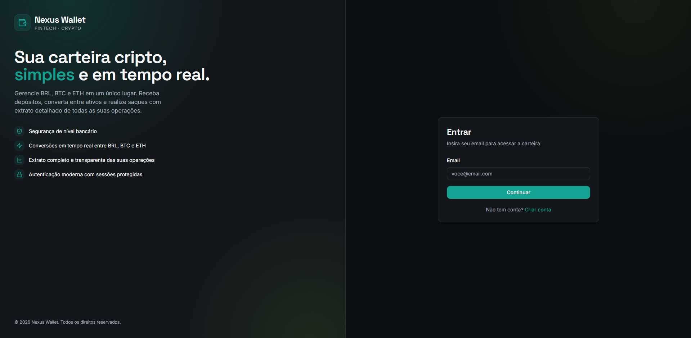
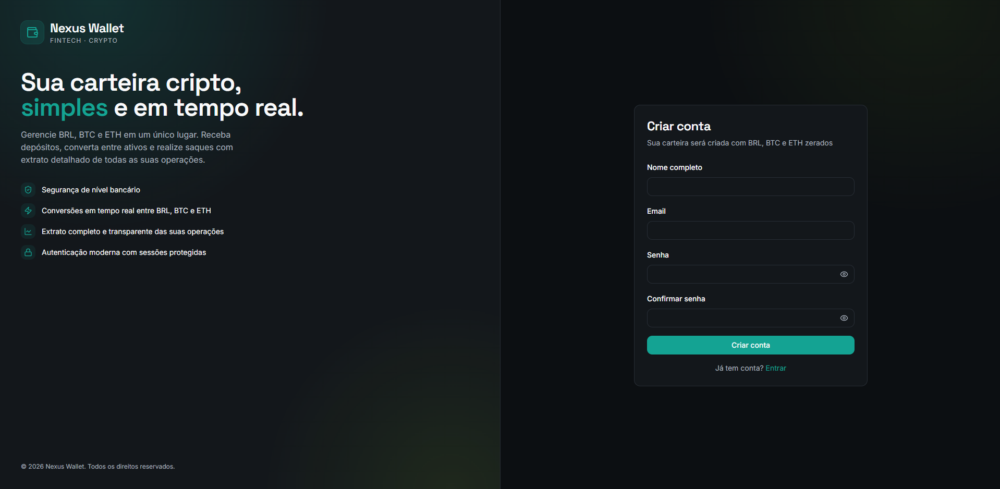
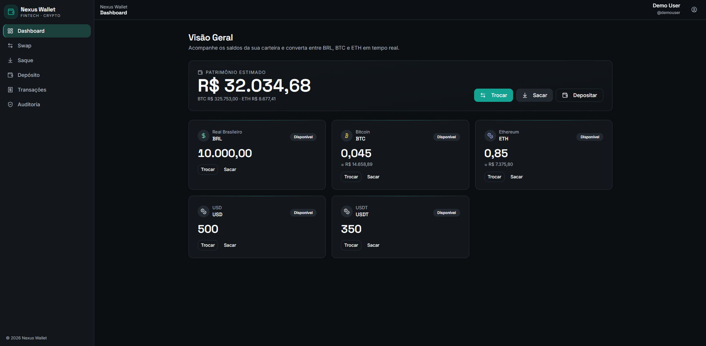
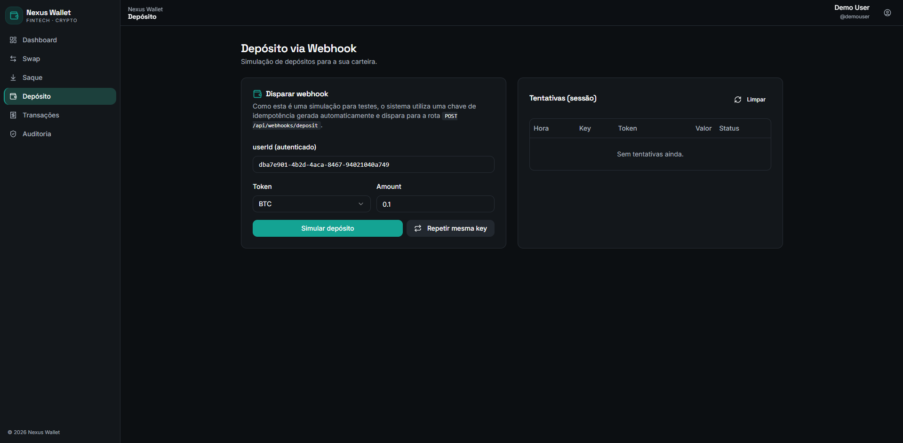
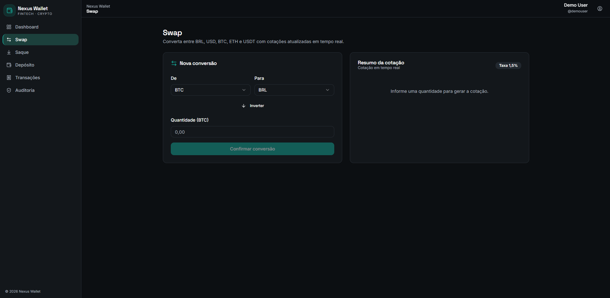
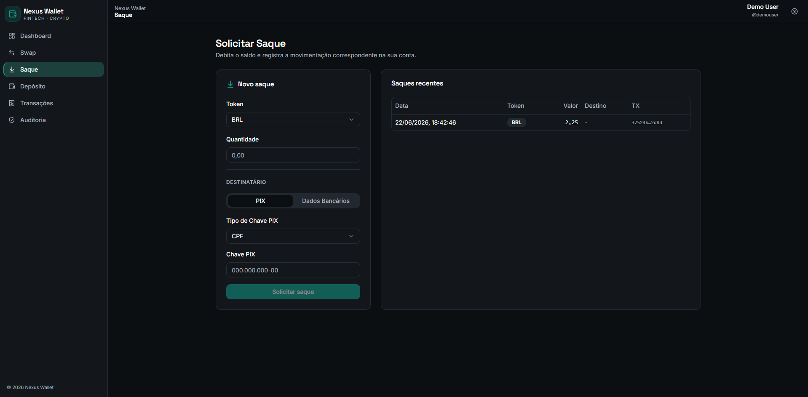
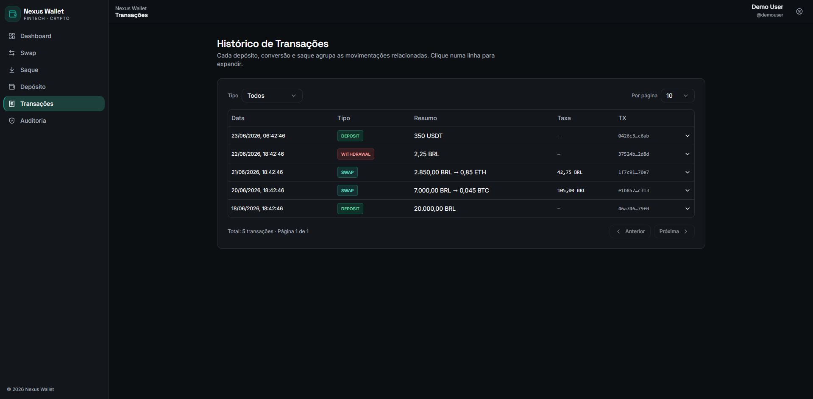
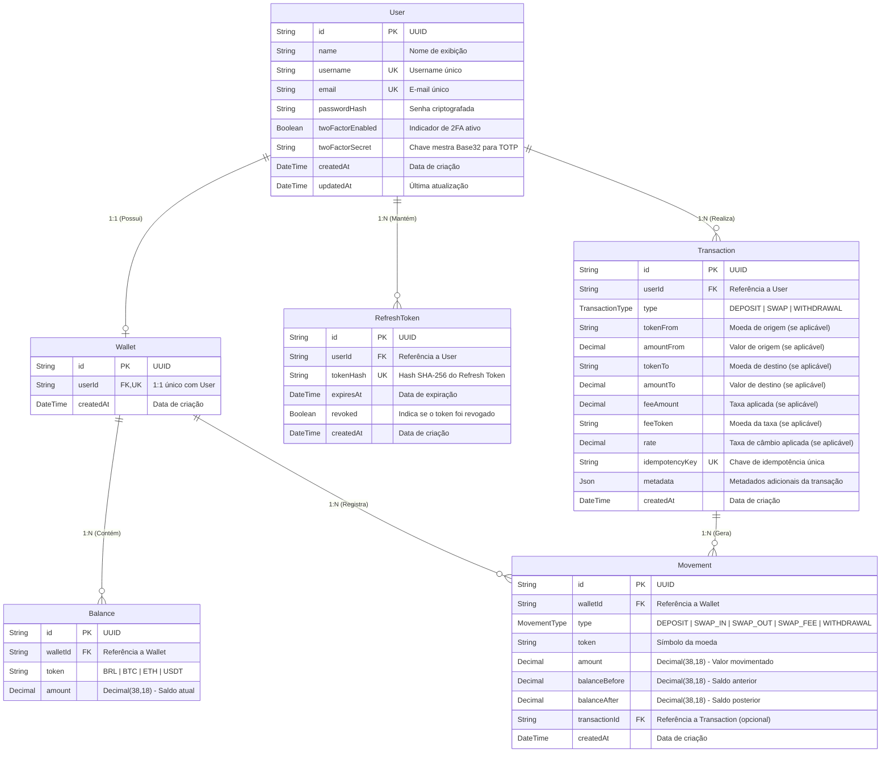

# Nexus Crypto Wallet — API REST & Frontend

Implementação do teste técnico para a vaga de Desenvolvedor na Nexus. O projeto consiste em uma aplicação completa contendo uma API REST de carteira cripto simplificada e segura, com modelagem de dados auditável via ledger virtual, autenticação JWT com cookies seguros, operações de depósito, swap e saque, e listagens paginadas.

Além dos requisitos obrigatórios, foram implementados todos os diferenciais opcionais: cache de cotações com Redis, front-end em React consumindo a API de forma segura e execução completa via Docker Compose configurado com um gateway de porta única.

---

## Stacks e Tecnologias

A tabela abaixo detalha as ferramentas utilizadas no projeto, divididas entre a stack obrigatória e os diferenciais sugeridos que foram integrados:

| Componente | Tecnologia | Papel no Projeto | Tipo de Stack |
| :--- | :--- | :--- | :--- |
| **Node.js** | v20 | Ambiente de execução para o servidor backend | Obrigatória |
| **TypeScript** | v6.0 | Garantia de tipagem estática em toda a base de código | Obrigatória |
| **PostgreSQL** | v14+ | Banco de dados relacional principal | Obrigatória |
| **Prisma** | v5.22 | ORM para modelagem, migração e consultas seguras | Obrigatória |
| **Fastify** | v5.8 | Framework backend de alta performance e baixo overhead | Opcional / Diferencial |
| **Redis** | v5.4 | Cache temporário de cotações com TTL de 30 segundos | Opcional / Diferencial |
| **React** | v19.0 | Interface SPA responsiva construída com Tailwind e shadcn/ui | Opcional / Diferencial |
| **Docker** | v24+ | Empacotamento de containers e orquestração via docker-compose | Opcional / Diferencial |
| **Speakeasy / TOTP** | v2.0 | Geração e validação de senhas temporárias (2FA / Passwordless) | Segurança / 2FA |

---

## Estrutura do Projeto

O projeto foi desenhado com arquitetura desacoplada: frontend e backend são independentes. Eles podem ser orquestrados juntos no mesmo ambiente (via Docker Compose) ou publicados separadamente em plataformas distintas (ex: Vercel para o front, Render/Railway para o back). A organização segue:

```text
Nexus-Wallet/
|-- backend/                 # Node.js REST API
|   |-- prisma/              # Schema do banco, migrations e seeds
|   |-- scripts/             # Scripts utilitários e provas de conceito
|   |-- src/                 # Código-fonte da aplicação (Fastify, Services, Routing)
|   |-- Dockerfile           # Instruções de build do container do backend
|-- deploy/                  # Configurações de infraestrutura e deploy
|   |-- composer/            # Arquivos do Docker Compose (Dev e Prod)
|   |-- railway/             # Configuração para deploy no Railway
|   |-- render/              # Configuração para deploy no Render
|   |-- vercel/              # Configuração para deploy na Vercel
|-- frontend/                # React Single Page Application (SPA)
|   |-- public/              # Arquivos estáticos
|   |-- src/                 # Componentes React, páginas, hooks e rotas
|   |-- package.json         # Dependências do frontend
|   |-- vite.config.ts       # Configuração do bundler Vite
|-- .env                     # Variáveis de ambiente centralizadas para o monorepo
|-- .env.example             # Template padrão para o arquivo .env
|-- README.md                # Documentação principal do projeto
```

---

## Funcionalidades

### Autenticação e Segurança (2FA)
Cadastro com e-mail e senha, login retornando Access Token (JWT) no payload e Refresh Token rotativo. O Refresh Token é armazenado em cookie seguro `HTTPOnly` com escopo restrito a `/api/auth` para mitigar ataques Cross-Site Scripting (XSS). Middleware `authGuard` protegendo todas as rotas restritas.

A aplicação possui suporte a **Autenticação em Duas Etapas (2FA)** usando TOTP.
- **Se 2FA inativo**: O login exige E-mail e Senha.
- **Se 2FA ativo**: O login exige E-mail e Senha, seguido de uma verificação adicional pelo Código do Aplicativo (ex: Google Authenticator), aumentando drasticamente a segurança da conta. Adicionalmente, dispositivos podem ser "Lembrados" (Trusted Devices) de forma invisível emitindo cookies extras, garantindo que usuários regulares não precisem redigitar o código continuamente.




### Carteira e saldos
Ao se cadastrar, o usuário recebe uma carteira com saldo zero para os quatro tokens suportados: BRL, BTC, ETH e USDT. Os saldos são gerenciados de forma atômica no banco de dados e são sempre auditáveis matematicamente.



### Depósito via webhook
Endpoint `POST /api/webhook/deposit` simulando notificação de serviço de pagamento externo. Valida a chave de idempotência `idempotencyKey` para evitar créditos duplicados, credita o token correspondente e retorna erro caso o usuário ou token não existam. Protegido por assinatura Timing-Safe HMAC caso a chave esteja definida no ambiente.



### Rate Limiting & Prevenção de Abuso
A API está protegida globalmente contra força bruta e picos de acessos usando o `@fastify/rate-limit`. A cota padrão está configurada para 100 requisições por minuto por IP. Requisições excedentes receberão o status `HTTP 429 Too Many Requests`.

### Swap (Conversão entre Tokens)
A cotação utiliza a API pública da CoinGecko (`/simple/price`) para obter valores de mercado atualizados no exato momento da conversão. Sobre o preço de tela, é aplicada uma taxa fixa (padrão 1,5%) cobrada do token de destino. Para contornar os rate limits da camada gratuita da CoinGecko e melhorar a latência, todas as cotações ficam cacheadas ativamente no Redis por 30 segundos. Se o Redis ficar offline, a aplicação possui um mecanismo de fallback resiliente e faz a busca direta na API externa para garantir altíssima disponibilidade.

Na execução do Swap, o sistema valida se há saldo suficiente (debitando o token de origem), adquire travas de linha exclusivas no banco (`SELECT ... FOR UPDATE`), realiza os débitos e créditos e registra a transação com suas movimentações correspondentes.



### Saque
Valida saldo suficiente, debita o token solicitado e registra a transação e a movimentação no ledger. A transferência física é mockada (simulada), conforme especificação do teste.



### Ledger Embutido (Auditoria de Movimentações)
Toda alteração de saldo gera registros imutáveis no ledger interno com tipo, token, valor, saldo anterior, saldo novo e data/hora. O saldo atual pode ser integralmente reconstruído a partir do histórico de movimentações. No front-end, os registros do ledger podem ser visualizados ao expandir os detalhes de cada transação no Histórico.

Tipos registrados: `DEPOSIT`, `SWAP_IN`, `SWAP_OUT`, `SWAP_FEE` e `WITHDRAWAL`.

### Histórico de transações
Listagem paginada das transações do usuário com tipo (`DEPOSIT`, `SWAP`, `WITHDRAWAL`), tokens envolvidos, valores de origem e destino, taxa quando aplicável e data/hora.



---

## Como rodar o projeto localmente

### Opção A: Docker Compose (Recomendado)
Pré-requisito: **Docker** e **Docker Compose** instalados na máquina.

Na raiz do projeto, execute o seguinte comando para construir as imagens e iniciar os containers em segundo plano:
```bash
docker compose -f deploy/composer/docker-compose.yml up --build -d
```

Após a inicialização, a aplicação estará disponível em:
- **Frontend (Vite com Hot-Reload):** [http://localhost:5173](http://localhost:5173)
- **API REST direta:** [http://localhost:8002/api](http://localhost:8002/api)

---

## Deploy em Produção

O projeto foi projetado para rodar nativamente em ambientes Cloud através de dois modos principais: um Gateway Unificado via Docker ou uma arquitetura separada Frontend/Backend (como Vercel + VPS).

### Opção A: Gateway Unificado com Docker Compose
Esta é a abordagem mais robusta e simples. O `docker-compose.prod.yml` cria o banco de dados, o Redis e a aplicação em containers. O `Dockerfile` no backend é construído em múltiplas etapas (*multi-stage build*), compilando tanto a API (Fastify) quanto os ativos do Frontend (React). O servidor Fastify atua então como um gateway unificado na porta `8001`, servindo o React na raiz (`/`) e a API em `/api`.

```bash
docker compose -f deploy/composer/docker-compose.prod.yml up --build -d
```

### Opção B: Vercel (Frontend estático) + Backend Cloud (Railway, Render, VPS)
Para aproveitar a CDN global da Vercel para os arquivos estáticos:
1. **Frontend na Vercel:** Suba apenas a pasta `/frontend` na Vercel (comando de build: `npm run build`, output: `dist`). O deploy na Vercel utiliza um arquivo `middleware.js` inteligente no Frontend, que atua como proxy reverso dinâmico para interceptar chamadas `/api/*` e encaminhá-las ao backend real. Isso resolve problemas de CORS e impede erros de Mixed Content (conteúdo misto) caso o backend não possua HTTPS nativo.
2. **Variável Backend:** Cadastre na Vercel a variável de ambiente `VITE_API_URL` com a URL do seu backend vivo (ex: `https://123.456.78.9:8002`). O middleware lerá essa variável e fará o roteamento transparente.
3. **Hospedagem do Backend:** Suba o backend utilizando Node.js tradicional + PM2, Docker ou Plataformas PaaS (como Render ou Railway), conectando a instâncias gerenciadas do PostgreSQL e do Redis. Certifique-se de preencher as variáveis do `.env` correspondentes e expor a porta correta.

### Opção C: Execução Manual (Sem Docker)

#### Pré-requisitos
- Node.js (v20 ou superior)
- PostgreSQL (v14 ou superior)
- Redis (v6 ou superior)

#### Configurar banco de dados e Redis
Suba instâncias locais do PostgreSQL e do Redis em sua máquina de desenvolvimento. Crie um banco de dados vazio chamado `nexus_wallet`.

#### Configurar e executar o backend
Abra um terminal na pasta `backend`:

Copie o arquivo de exemplo de variáveis de ambiente:
```bash
cd backend
cp .env.example .env
```

Instale as dependências:
```bash
npm install
```

Crie a estrutura de tabelas no banco e gere o cliente do Prisma:
```bash
npx prisma db push
```

Execute o script de seed para criar o usuário padrão de testes:
```bash
npm run seed
```

> **Credenciais do Usuário Demo:**
> - **E-mail:** `demo@nexus.com`
> - **Senha:** `Demo@1234!`
> 
> *Dica: Se precisar rodar o seed dentro de um container de produção (onde a pasta src não existe e o tsx não está instalado globalmente), utilize o comando: `mkdir -p src/config && touch src/config/dotenv.ts && npx tsx prisma/seed.ts`*

Inicie a API principal (escutando na porta `8002`):
```bash
npm run dev
```

Inicie o Proxy Gateway em outro terminal dentro da pasta `backend` (escutando na porta `8001`):
```bash
npm run proxy
```

#### Configurar e executar o frontend
Abra um terminal na pasta `frontend`:

Instale as dependências do React:
```bash
cd frontend
npm install
```

Inicie o servidor de desenvolvimento do React (escutando na porta `3000`):
```bash
npm start
```

#### Acessando a aplicação
Com os servidores rodando:
- **Frontend:** [http://localhost:5173](http://localhost:5173) (O Vite fará proxy automático para o backend na porta 8002).
- **Backend:** [http://localhost:8002/api](http://localhost:8002/api)

---

### Executando os Testes (Vitest)
Para rodar a suíte de testes unitários e de integração do backend:
```bash
cd backend
npm run test
```

---

## Decisões técnicas relevantes

### Fastify e Proxy Gateway Unificado
Optamos pelo Fastify em vez do Express por conta de sua alta performance (até 2x mais rápido), suporte nativo a handlers assíncronos e sistema robusto de plugins. 

Implementamos um Proxy Gateway em Fastify na porta `8001` usando os plugins `@fastify/http-proxy` e `@fastify/static`. Ele atua como um ponto de entrada unificado: em desenvolvimento, repassa as requisições do frontend para a porta `3000` (mantendo o HMR do React ativo) e, em produção, serve diretamente a build estática compilada da pasta `frontend/build`. Isso elimina a necessidade de expor múltiplas portas no container Docker ou de configurar um Nginx separado, eliminando erros de CORS em produção e facilitando o deploy em qualquer VPS ou PaaS.

### Ledger como fonte de verdade
Qualquer alteração de saldo grava movimentações no ledger (`balances` e `movements`) com o estado exato anterior (`balanceBefore`) e novo (`balanceAfter`). Isso torna o sistema totalmente auditável: o saldo atual de qualquer moeda pode ser reconstruído do zero a partir do histórico de movimentações, e qualquer divergência ou inconsistência transacional é detectada imediatamente.

### Concorrência: Pessimistic Row Locking e Prevenção de Deadlocks
Sob alta concorrência, o uso de transações ACID simples não impede condições de corrida (ex: double-spending). Implementamos Pessimistic Locking (`SELECT ... FOR UPDATE` via consultas brutas Prisma) para garantir que apenas uma requisição por vez altere o saldo de uma carteira específica. 

Para evitar deadlocks em transações de Swap que travam dois tokens simultaneamente (ex: Usuário A faz BTC -> BRL e Usuário B faz BRL -> BTC concorrentemente), ordenamos os tokens alfabeticamente antes de adquirir os bloqueios. Assim, ambos os processos tentarão travar os recursos na mesma ordem, eliminando a possibilidade de travamento mútuo infinito.

### Idempotência no depósito
O endpoint de webhook valida a `idempotencyKey` antes de processar qualquer depósito. Isso reflete um cenário de integração financeira real, onde falhas de rede ou retentativas de provedores externos podem reenviar a mesma notificação, evitando que o saldo do usuário seja creditado em duplicidade.

#### Como provar idempotência no ambiente de testes:
1. No painel, acesse a página **Depósito**.
2. Faça um depósito clicando em **Simular depósito** com uma chave nova (gerada automaticamente). O status no histórico de tentativas será exibido como `creditado`.
3. Clique em **Repetir mesma key**. O backend receberá a mesma chave de idempotência e a requisição retornará `status: duplicate` no histórico, resolvendo a duplicidade sem creditar os saldos novamente.

### Cotações via CoinGecko + cache Redis
As cotações utilizam a API pública gratuita da CoinGecko. Como cotações cripto mudam constantemente e a API possui limites estritos de requisições por minuto, implementamos caching no Redis por 30 segundos. Se o Redis apresentar instabilidade ou ficar offline, o código captura a falha de rede e busca a cotação diretamente na API externa, garantindo alta disponibilidade.

### Contra imprecisões financeiras
Números flutuantes padrão IEEE 754 em Javascript (`number`) sofrem de erros acumulados de precisão (ex: `0.1 + 0.2 === 0.30000000000000004`). Em carteiras cripto e fiat, isso gera perdas financeiras. O projeto utiliza `Decimal.js` para cálculos de precisão arbitrária e mapeia os saldos como `Decimal(38, 18)` no PostgreSQL.

### Segurança: Cookies HTTPOnly contra XSS
Armazenar tokens JWT no LocalStorage expõe a sessão a roubo de credenciais via XSS. O projeto armazena o Refresh Token em um cookie seguro com flag `HTTPOnly` e escopo específico de rota `/api/auth`. A cada requisição de renovação, o token antigo é revogado e um novo Refresh Token é emitido e enviado ao cookie (Token Rotation), invalidando acessos antigos.

---

## Estrutura do banco de dados

A modelagem de dados no banco PostgreSQL mapeada pelo Prisma está estruturada da seguinte forma:

### Diagrama Entidade-Relacionamento (ER)



### Tabelas do Banco de Dados

A tabela abaixo descreve as entidades mapeadas no banco de dados e suas respectivas funções:

| Nome da Tabela | Entidade Prisma | Função no Sistema | Relacionamentos Principais |
| :--- | :--- | :--- | :--- |
| `users` | User | Credenciais, hashes de senhas e identificação básica dos usuários. | Relação 1:1 com `Wallet`, 1:N com `RefreshToken` e `Transaction`. |
| `wallets` | Wallet | Agrupador lógico de saldos e movimentações pertencentes a um usuário. | Relação 1:1 com `User`, 1:N com `Balance` e `Movement`. |
| `balances` | Balance | Tabela de estado contendo o saldo consolidado atual de cada token por carteira. | Relação N:1 com `Wallet` (chave composta única por token e carteira). |
| `movements` | Movement | Livro-razão (ledger) contendo registros imutáveis de cada alteração de saldo. | Relação N:1 com `Wallet` e N:1 opcional com `Transaction`. |
| `transactions` | Transaction | Agrupador lógico e auditável de cada depósito, swap ou saque. | Relação N:1 com `User` e 1:N com `Movement` gerados. |
| `refresh_tokens` | RefreshToken | Controle de sessões e histórico de tokens JWT rotativos ativos. | Relação N:1 com `User` (chave única por hash SHA-256). |

---

## Autor

Guilherme Santos
